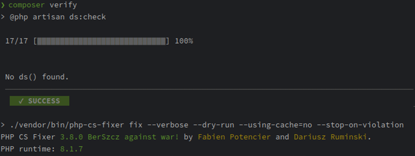

# Deploying to production

Since LaraDumps is a debug `dev` tool, you might want to check if you forgot a `ds()` somewhere in your code before you deploy your app to production.

LaraDumps provides the command `php artisan ds:check` which will produce an error if any `ds()` is found in your code.

## Pipeline

You can also add a custom `verify` script in your `composer.json`, and run `composer verify` in your deployment pipeline (CI/CD).

Example script: 

```json
"scripts": {
   "ds:check": "@php artisan ds:check",
   "verify": [
         "@ds:check",
         // ..
   ],
}
```

If any `ds()` is found, the `ds:check` command will indicate you the file, line and code snippet.


If you have not forgotten any `ds()`, your pipeline will be completed successfully.




